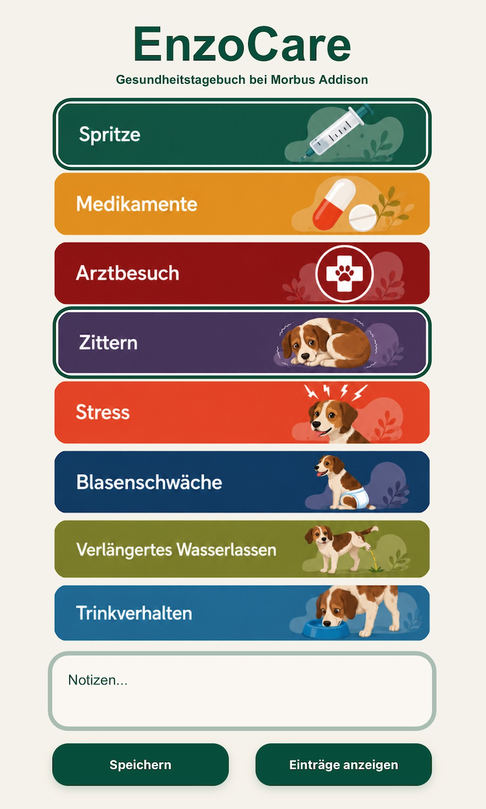
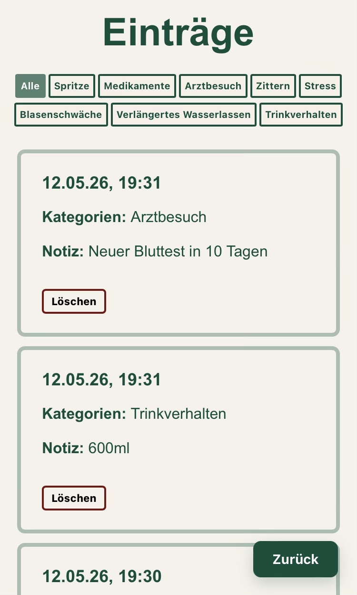

# EnzoCare

EnzoCare ist ein Symptom- und Gesundheitstracker für Hunde mit Morbus Addison.

Das Projekt entstand aus dem Wunsch, gesundheitliche Veränderungen meines Hundes Enzo schneller und unkomplizierter dokumentieren zu können als mit einer klassischen Notizen-App. Mithilfe der Filterfunktion lassen sich bei Tierarztbesuchen gezielt bestimmte Symptome und deren Verlauf nachvollziehen.

---

## Live-Demo

https://m-scholjegerdes.github.io/EnzoCare/

---

## Screenshots

### Startseite



### Eintragsliste



---

## Features

- Symptom-Erfassung über Bild-Buttons
- Speicherung der Einträge im Browser mit `localStorage`
- Filterbare Eintragsliste
- Löschen einzelner Einträge
- Validierung von Eingaben
- Responsive Design für Smartphone, Tablet und Desktop

---

## Verwendete Technologien

- HTML5
- CSS3
- JavaScript
- LocalStorage
- Git & GitHub
- GitHub Pages

---

## Projektstruktur

```text
EnzoCare/
│
├── index.html
├── entries.html
├── style.css
├── script.js
├── entries.js
│
├── buttons/
│   ├── spritze.png
│   ├── medikamente.png
│   ├── arztbesuch.png
│   ├── zittern.png
│   ├── stress.png
│   ├── blasenschwaeche.png
│   ├── verlaengertes-wasserlassen.png
│   └── trinkverhalten.png
│
└── README.md
```

---

## Funktionsweise

Einträge werden lokal im Browser mit `localStorage` gespeichert.

Die Eintragsliste kann über verschiedene Filterbuttons nach Kategorien durchsucht werden.

---

## Responsive Design

Die Anwendung wurde speziell für die Nutzung auf Smartphones entwickelt und anschließend für Tablets und Desktop-Bildschirme optimiert.

Verwendete Techniken:

- Flexbox
- Media Queries
- Responsive Schriftgrößen mit `clamp()`
- Mobile-First-Ansatz

---

## Herausforderungen & Learnings

Während des Projekts habe ich gelernt:

- HTML, CSS und JavaScript strukturiert aufzubauen
- Benutzeroberflächen responsive für verschiedene Geräte zu gestalten
- Daten mit LocalStorage zu speichern
- JavaScript-Dateien sinnvoll aufzuteilen
- Filterlogik und EventListener zu strukturieren
- Git und GitHub zur Versionskontrolle zu verwenden
- Code zu refactoren und sauber zu strukturieren

---

## Zukunftsideen

Geplante mögliche Erweiterungen:

- Datenbank-Anbindung
- Synchronisierung zwischen mehreren Geräten
- Bearbeiten bestehender Einträge
- Manuelle Auswahl eines Datums für Einträge
- Statistik- und Verlaufsansichten
- Exportfunktion für Tierarztbesuche
- Benutzerkonten


---

## Autorin

Marie S.